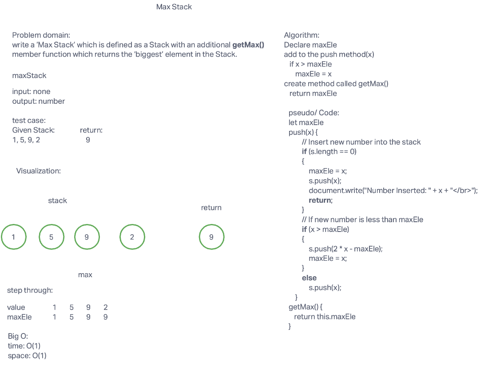

# Max Stack

## Challenge Summary

<!-- Description of the challenge -->

Write a ‘Max Stack’ which is defined as a Stack with an additional getMax() member function which returns the ‘biggest’ element in the Stack.

## Whiteboard Process

<!-- Embedded whiteboard image -->

## Approach & Efficiency

<!-- What approach did you take? Why? What is the Big O space/time for this approach? -->

This approach keep track of the max element from the beginning when the value is first push in to the stack. If the number is greater then the current max element then make the maxEle to be the new number.

## Big O

Time: O(1)

Space: O(1)

## Solution

<!-- Show how to run your code, and examples of it in action -->

[Code link](./max-stack.js)

## Rubric

[Rubric link](https://docs.google.com/spreadsheets/d/1tdq-UhPuUevquj5We1OWgN93vlPhVG2JNLa1kfTtZ-0/edit#gid=1218174940)
