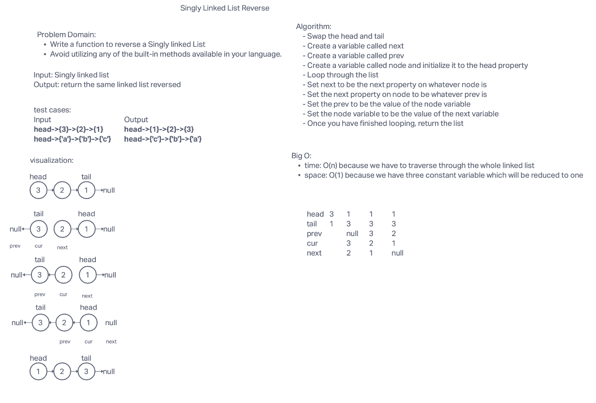

# singly-linked-list-reversed

## Challenge Summary

- Write a function to reverse a singly linked list
- avoid utilizing any of the built-in methods available to your language

## Whiteboard Process

## Approach & Efficiency

<!-- What approach did you take? Why? What is the Big O space/time for this approach? -->

Pseudo Code:

- Swap the head and tail
- Create a variable called next
- Create a variable called prev
- Create a variable called node and initialize it to the head property
- Loop through the list
- Set next to be the next property on whatever node is
- Set the next property on node to be whatever prev is
- Set the prev to be the value of the node variable
- Set the node variable to be the value of the next variable
- Once you have finished looping, return the list

## Big O

Time: O(n)

Space: O(1)

## Solution

[Code link](./singly-linked-list-reversed.js)

## Grading Rubric

[Rubric link](https://docs.google.com/spreadsheets/d/1tdq-UhPuUevquj5We1OWgN93vlPhVG2JNLa1kfTtZ-0/edit#gid=297240503)
