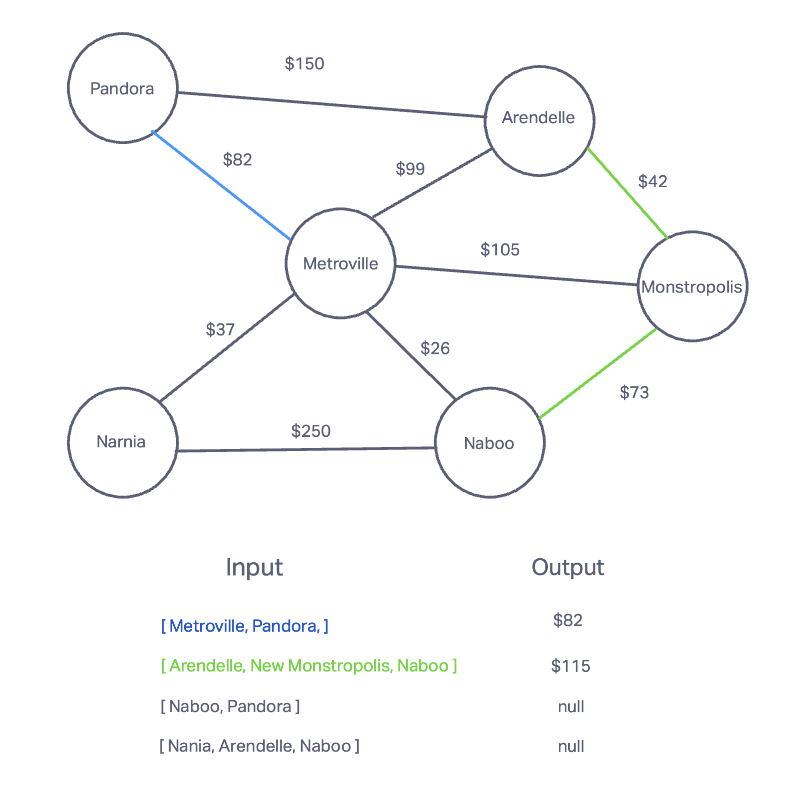

# Graph business trip

## Code Challenge

Given a business trip itinerary, and an Alaska Airlines route map, is the trip possible with direct flights? If so, how much will the total trip cost be?

## Feature Tasks

- Write a function called business trip
- Arguments: graph, array of city names
- Return: the cost of the trip (if it’s possible) or null (if not)

Determine whether the trip is possible with direct flights, and how much it would cost.

