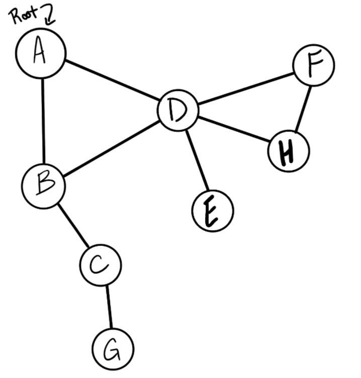

# Depth First Traversal

<!-- Short summary or background information -->

A breadth first traversal of a graph visits every vertex in a graph once and traverses vertices that are closer to the start before vertices that are farther away. It is like a ripple moving from one point out the the edges.

A breadth first traversal of a graph will use a queue to keep track of which vertex to visit next, and a list of visited vertices to avoid visiting those a second time, in case of a cycle.

## Challenge

<!-- Description of the challenge -->

Write the following method for the Graph class:

Name: Depth first
Arguments: Node (Starting point of search)
Return: A collection of nodes in their pre-order depth-first traversal order
Program output: Display the collection

## Approach & Efficiency

<!-- What approach did you take? Why? What is the Big O space/time for this approach? -->

input:

output: A, B, C, G, D, E, H, F

## Big O

time: O(v)

space: O(1)

## Solution

[Code link](./graph-depth-first.js)

install packages:

    npm i

run test:

    npm test graph-depth-first

## Test

[Test link](.-/../graph-depth-first.test.js)
