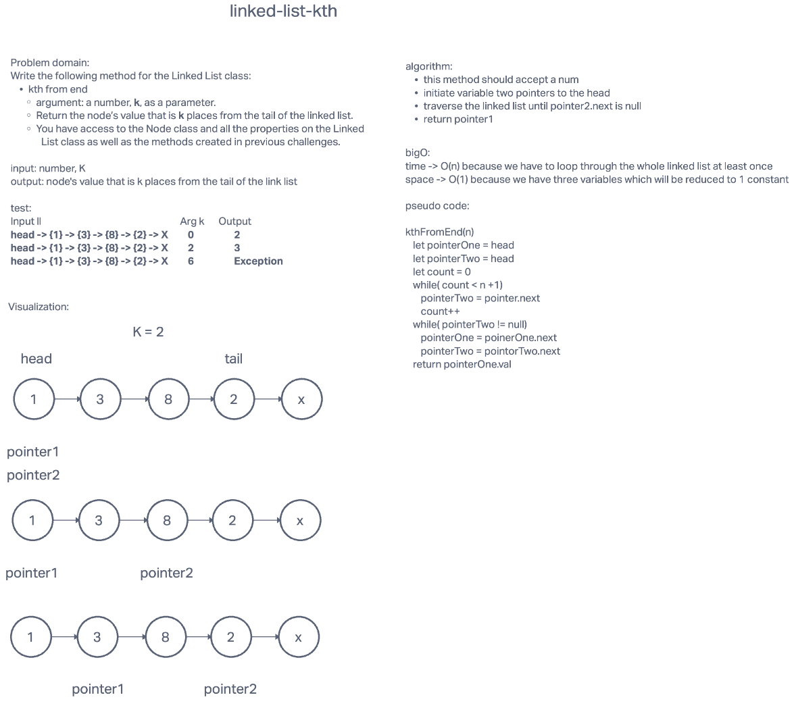

# Linked-list-kth

## Challenge Summary

Write the following method for the Linked List class:

    kth from end
    argument: a number, k, as a parameter.
    Return the node’s value that is k places from the tail of the linked list.
    You have access to the Node class and all the properties on the Linked List class as well as the methods created in previous challenges.

## Whiteboard Process

## Approach & Efficiency

<!-- What approach did you take? Why? What is the Big O space/time for this approach? -->

This approach uses two pointers. One pointer is set to the head of the linked list and the second pointer pointing to the Kth node from the head. Loop till the second pointer gets to the end of the linked list. The first pointer will then be the Kth node from the end tail of the list.

## Solution

[Code link](linked-list-kth.js)

<!-- Show how to run your code, and examples of it in action -->

install packages:

    npm i

run test:

    npm test linked-list-kth.test.js
