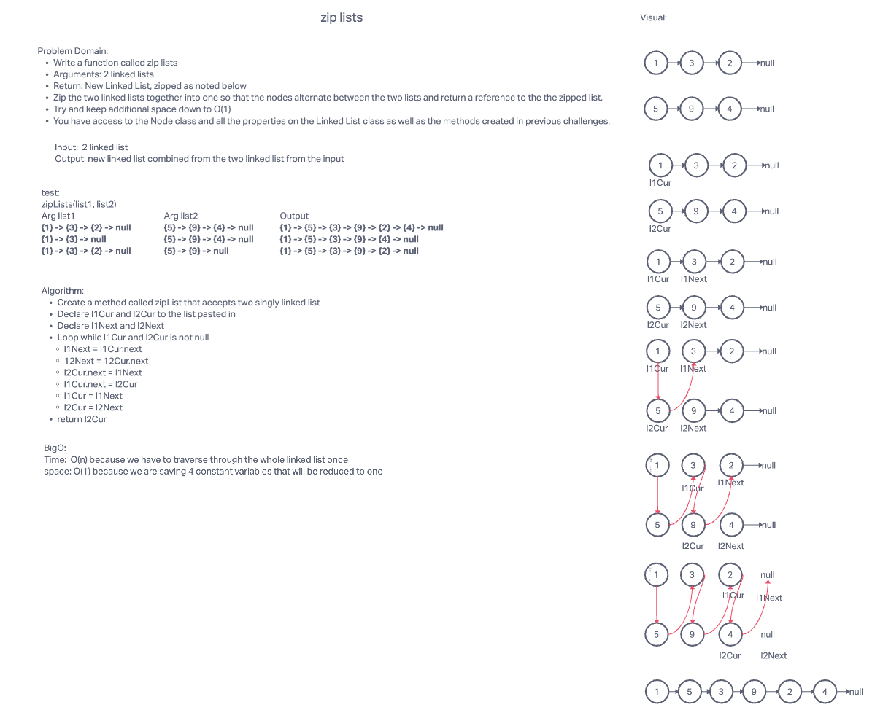

# Linked-list-zip

## Challenge Summary

- Write a function called zip lists
- Arguments: 2 linked lists
- Return: New Linked List, zipped as noted below
- Zip the two linked lists together into one so that the nodes alternate between the two lists and return a reference to the the zipped list.
- Try and keep additional space down to O(1)
- You have access to the Node class and all the properties on the Linked List class as well as the methods created in previous challenges.

## Whiteboard Process

## Approach & Efficiency

<!-- What approach did you take? Why? What is the Big O space/time for this approach? -->

The approach to this solution is to create current pointers for the lists past in and pointers for the next values for each list. Loop through the linked lists while the current pointer are not null. Set the l2Cur.next to point to l1.next. Set the l1Cur.next to l2Cur. Set the l1Cur to l1next and l2Cur to l2Next. Return l1 after loop is done.

## Big O

time: O(n)

space: O(1)

## Solution

[Code link](linked-list-zip.js)

<!-- Show how to run your code, and examples of it in action -->

install packages:

    npm i

run test:

    npm test linked-list-zip.test.js
