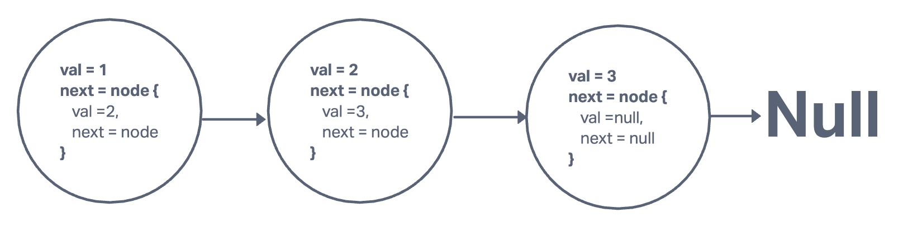

# Singly Linked List

## Challenge

- Create a Linked List class
- Within your Linked List class, include a head property.
  - Upon instantiation, an empty Linked List should be created.
- The class should contain the following methods
  - insert
    - Arguments: value
    - Returns: nothing
    - Adds a new node with that value to the head of the list with an O(1) Time performance.
  - includes
    - Arguments: value
    - Returns: Boolean
      - Indicates whether that value exists as a Node’s value somewhere within the list.
  - to string
    - Arguments: none
    - Returns: a string representing all the values in the Linked List, formatted as:
      "{ a } -> { b } -> { c } -> NULL"

## Approach & Efficiency

insert:
Time: O(1)
Space: O(1)

include:
Time: O(n)
Space: O(1)

toString:
Time: O(n)
Space: 0(1)

## Code

```javascript
class Node {
  constructor(val) {
    this.val = val;
    this.next = null;
  }
}

class LinkList {
  constructor() {
    this.head = null;
  }
  insert(val) {
    let newNode = new Node(val);
    newNode.next = this.head;
    this.head = newNode;
    return;
  }
  includes(val) {
    let cur = this.head;
    while (cur) {
      if (cur.val === val) {
        return true;
      }
      cur = cur.next;
    }
    return false;
  }
  toString() {
    let str = "";
    let cur = this.head;
    while (cur) {
      str = str.concat(`{${cur.val}} -> `);
      cur = cur.next;
    }
    str = str.concat("NULL");
    return str;
  }
}
```

## Whiteboard


