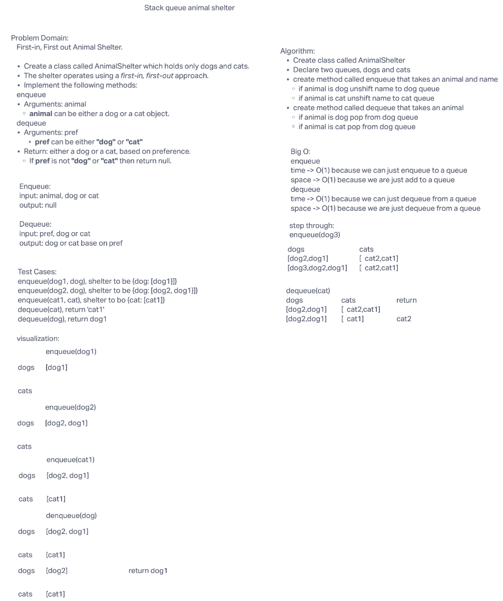

# stack-queue-animal-shelter

## Challenge Summary

- Create a class called AnimalShelter which holds only dogs and cats.
- The shelter operates using a first-in, first-out approach.
- Implement the following methods:
  - enqueue
    - Arguments: animal
      - animal can be either a dog or a cat object.
  - dequeue
    - Arguments: pref
      - pref can be either "dog" or "cat"
    - Return: either a dog or a cat, based on preference.
      - If pref is not "dog" or "cat" then return null.

## Whiteboard Process

## Approach & Efficiency

<!-- What approach did you take? Why? What is the Big O space/time for this approach? -->

This approach uses two queues, one for dogs and one for cats. Depending on what kind of animal was passed in, it will be queued into either the dog or cat queue. User can dequeue an animal from teh shelter and pass in a preference of dog or cat, but cat pick which cat or dog. This shelter is a first in first out shelter. You can only choose what kind of animal, cat or dog.

## Big O

enqueue

time: O(1)

space: O(1)

dequeue

time: O(1)

space: O(1)

## Solution

[Code link](./stack-queue-animal-shelter.js)

<!-- Show how to run your code, and examples of it in action -->

install packages:

    npm i

run test:

    npm test stack-queue-animal-shelter
