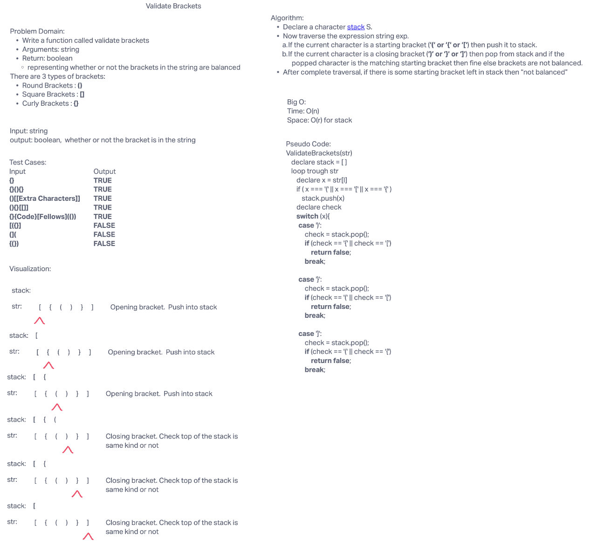

# Validate Bracket

Given a str, write a function to check if whether the pairs brackets {},(),[] are correct in the str

## Whiteboard Process

## Approach & Efficiency

- If the current character is a starting bracket (‘(‘ or ‘{‘ or ‘[‘) then push it to stack.
- If the current character is a closing bracket (‘)’ or ‘}’ or ‘]’) then pop from stack and if the popped character is the matching starting bracket then fine else brackets are not balanced.
- if there is some starting bracket left in stack then “not balanced”

## Big O

Time: O(n)
Space: O(n) for stack

## Solution

[Code link](./stack-queue-brackets.js)

install packages:

    npm i

run test:

    npm test stack-queue-brackets
