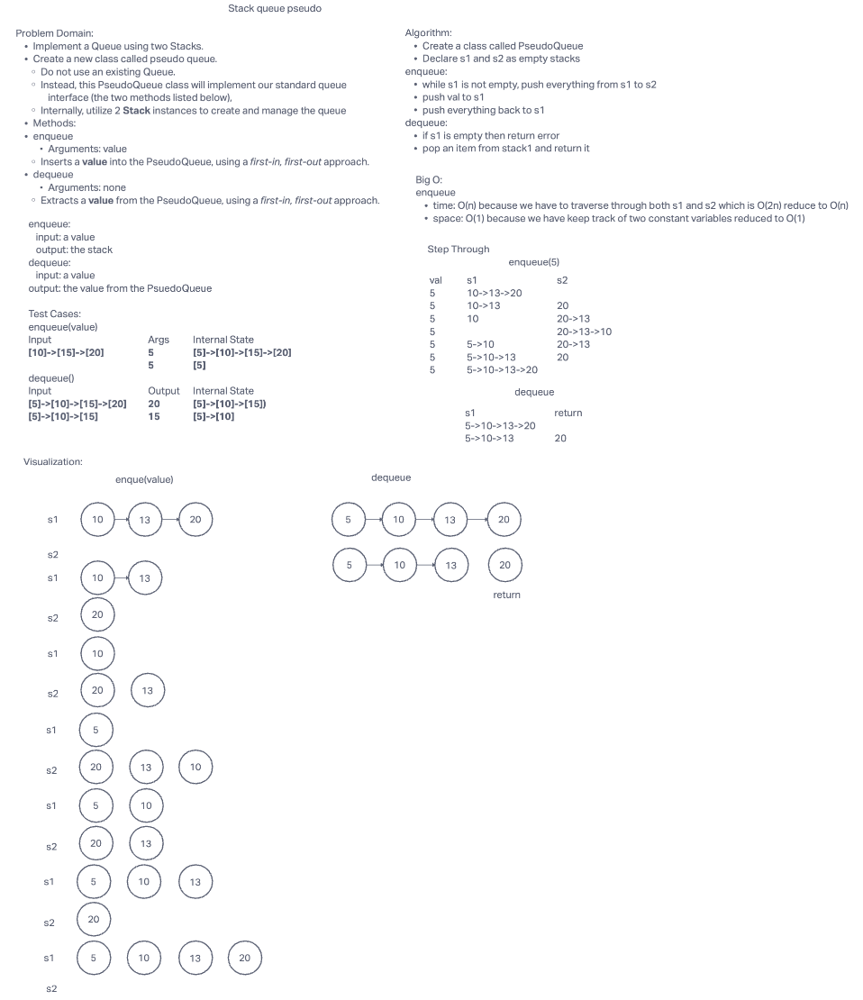

# Stack queue pseudo

## Challenge Summary

Implement a Queue using two Stacks.

- Create a new class called pseudo queue.
- Do not use an existing Queue.
- Instead, this PseudoQueue class will implement our standard queue interface (the two methods listed below),
- Internally, utilize 2 Stack instances to create and manage the queue

## Whiteboard Process

## Approach & Efficiency

<!-- What approach did you take? Why? What is the Big O space/time for this approach? -->

Queue can be implemented using two stacks. Pop everything from the first stack to the second stack. Add the new value to the first stack, then pop everything back from the second stack back to the first stack.

## Big O

time: O(n)

space: O(1)

## Solution

[Code link](./stack-queue-pseudo.js)

<!-- Show how to run your code, and examples of it in action -->

install packages:

    npm i

run test:

    npm test stack-queue-pseudo.test.js
