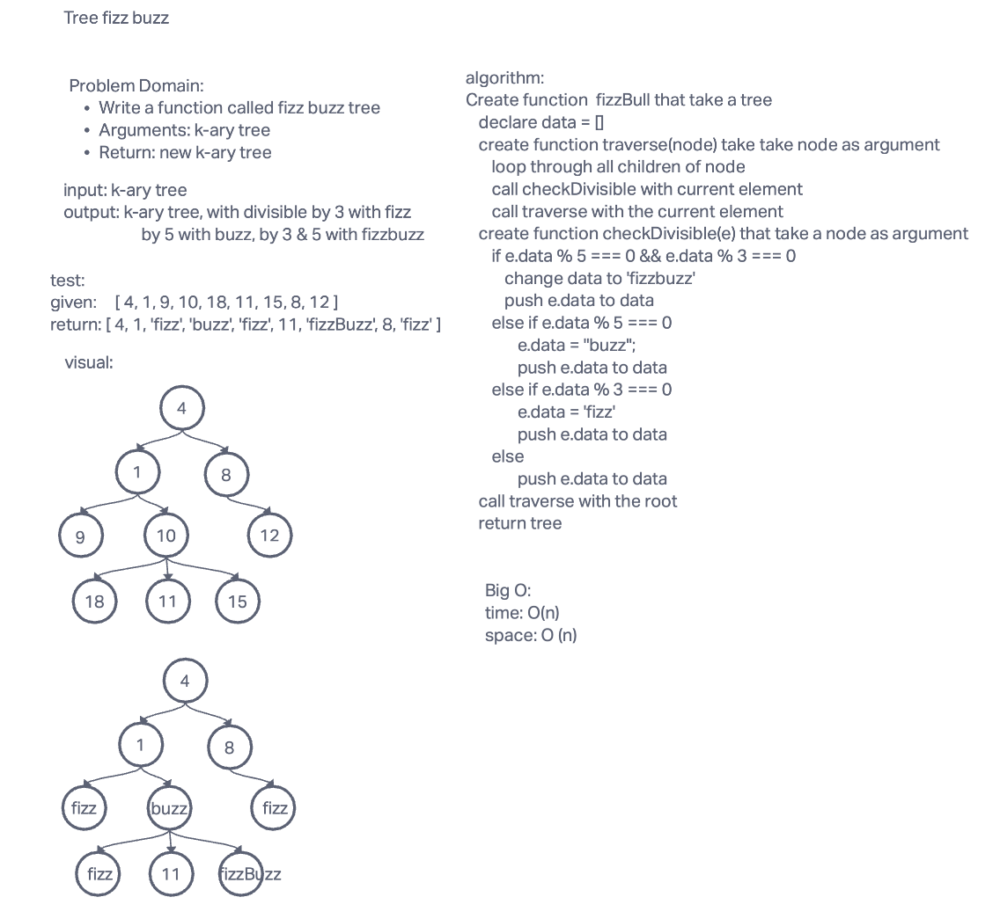

# Tree fizz buzz

## Summary

<!-- Description of the challenge -->

Write a function called fizz buzz tree
Arguments: k-ary tree
Return: new k-ary tree
Determine whether or not the value of each node is divisible by 3, 5 or both. Create a new tree with the same structure as the original, but the values modified as follows:

If the value is divisible by 3, replace the value with “Fizz”
If the value is divisible by 5, replace the value with “Buzz”
If the value is divisible by 3 and 5, replace the value with “FizzBuzz”
If the value is not divisible by 3 or 5, simply turn the number into a String.

## Whiteboard Process

<!-- Embedded whiteboard image -->

## Approach & Efficiency

<!-- What approach did you take? Why? What is the Big O space/time for this approach? -->

This approach was done by using the call stack and recursively traverse the tree and check if it's divisible by 3 or 5, then changing that value to fizz or buzz

## Solution

<!-- Show how to run your code, and examples of it in action -->

[Code link](./tree-fizz-buzz.js)

## Big O

Time: O(n)

Space: O(n)

install packages:

    npm i

run test:

    npm test tree-fizz-buzz

## Test

[Test link](./tree-fizz-buzz.test.js)
