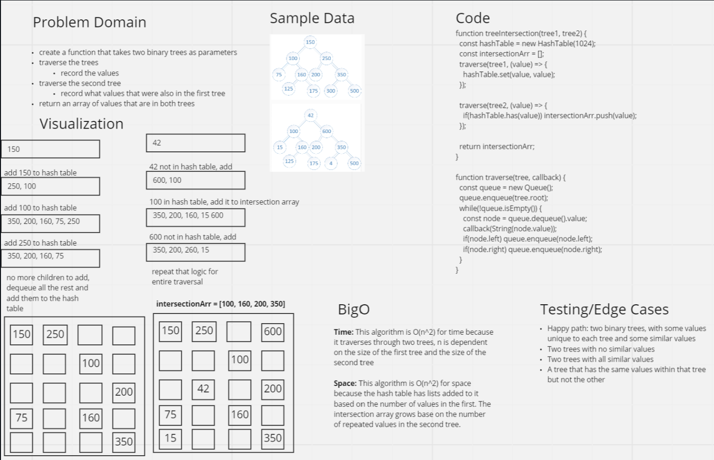

# Challenge Summary

<!-- Description of the challenge -->

The challenge was to make a function that takes in two binary trees and return an array of values that appear in both trees.

## Whiteboard Process

<!-- Embedded whiteboard image -->

## Big O

Time: O(n^2)

space: O(n^2)

## Solution

<!-- Show how to run your code, and examples of it in action -->

install packages:

    npm i

run test:

    npm test tree-intersection

## Test

[Test link](./tree-intersection.test.js)
