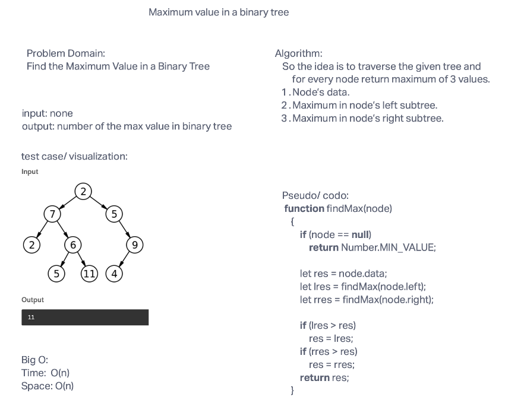

# Tree Max

## Challenge Summary

<!-- Description of the challenge -->

Write the following method for the Binary Tree class

find maximum value
Arguments: none
Returns: number
Find the maximum value stored in the tree. You can assume that the values stored in the Binary Tree will be numeric.

## Whiteboard Process

<!-- Embedded whiteboard image -->

## Approach & Efficiency

<!-- What approach did you take? Why? What is the Big O space/time for this approach? -->

So the idea is to traverse the given tree and for every node return maximum of 3 values.

Node’s data.
Maximum in node’s left subtree.
Maximum in node’s right subtree.

## Big O

Time: O(n)

Space: O(n)

## Solution

<!-- Show how to run your code, and examples of it in action -->

[Code link](./tree-max.js)

[Test link](./tree-max.test.js)

install packages:

    npm i

run test:

    npm test tree-max
