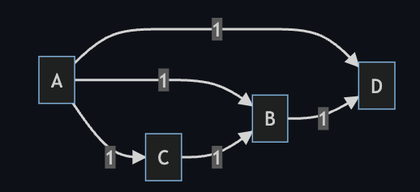
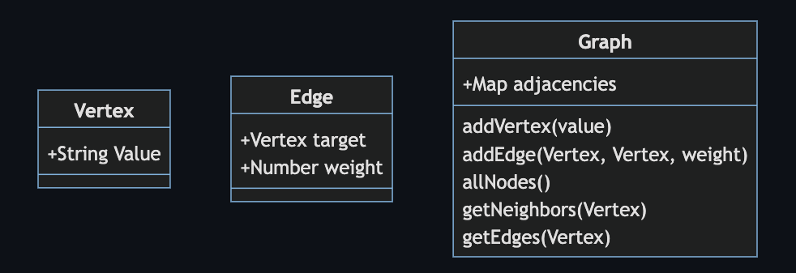

# Graphs

A graph can be implemented using an adjacency list. For each vertex in the graph, there is an adjacency list for that vertex. The adjacency list will contain all the edges that come from that vertex. An edge will know what vertex it points to and its weight. With this information, we can describe the graph data structure.

## Example and diagram

Let's say we have this graph.

We would have a list of 4 vertices. [A, B, C, D]

We the vertices should each have an adjacency list. For vertex A, the adjacency list would have 3 edges.

    A: [
      {target: B, weight: 1}
      {target: C, weight: 1}
      {target: D, weight: 1}
    ]

If represent the entire graph as a Map, it would look like this:

    Map({
      A: [
        {target: B, weight: 1}
        {target: C, weight: 1}
        {target: D, weight: 1}
      ],
      B: [
        {target: D, weight: 1}
      ],
      C: [
        {target: B, weight: 1}
      ],
      D: []
    });

If we look carefully, we can follow each path from one vertex to the next. For example, we can start at A, then go to B. B will then go to D. D has no neighbors. If we also keep track of the weight as we go, we can find the cost of the path.

## Implementation

This implementation uses a `Map` as the adjacency list.

There are three classes used, `Graph`, `Vertex`, and `Edge`.

The classes are diagramed below:

## addVertex and addEdge

To add a vertex, you will put it into the adjacency list. Let's represent the adjacency list as a table and add A, B and C as vertices.

| Vertex | Adjacency list |
| ------ | -------------- |
| A      |                |
| B      |                |
| C      |                |

We can add an edge of weight 1 from A to B.

| Vertex | Adjacency list |
| ------ | -------------- |
| A      | [B, 1]         |
| B      |                |
| C      |                |

We can add another edge of weight 1 from A to C.

| Vertex | Adjacency list |
| ------ | -------------- |
| A      | [B, 1], [C, 2] |
| B      |                |
| C      |                |

Now let's add an edge of weight 10 from C to A

| Vertex | Adjacency list |
| ------ | -------------- |
| A      | [B, 1], [C, 2] |
| B      |                |
| C      | [A, 10]        |

Now, if we want to travel from A to C, we can see that C is in the adjacency list for A. (It is of weight 2.)

## allNodes

If we want to get all the nodes in the graph, we can just take all the `keys` of the map.

## getEdges

If we want the neighbors of A, we look in the adjacency list for A and return all the the edges found there.

## getNeighbors

To get the vertices that are neighbors of A, we will also look in the adjacency list for A, then we will find the target of each edge we find there.
