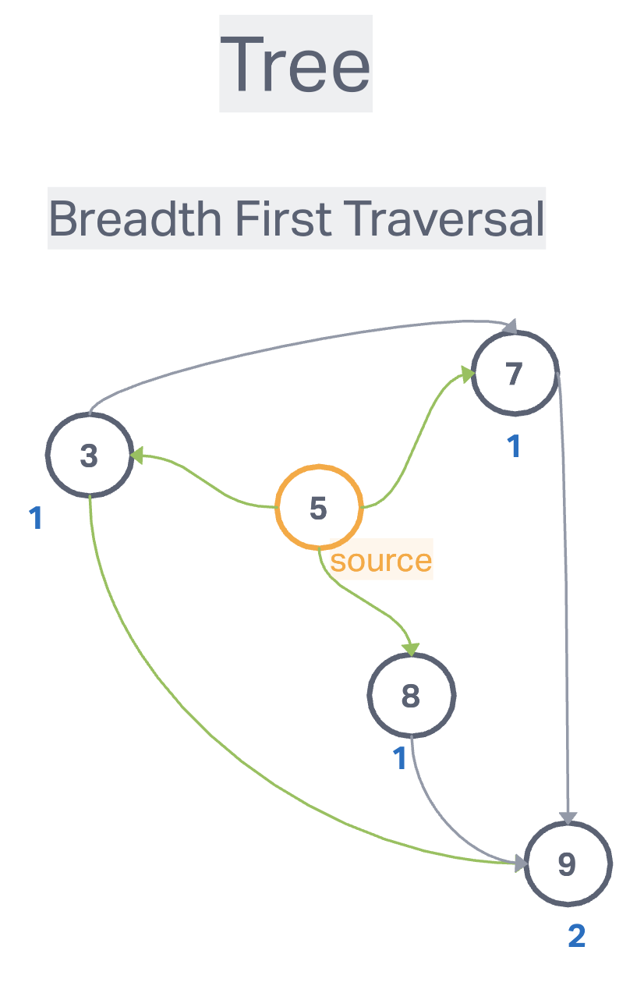

# Graph

## Algorithm

### Breadth First

- function should accept a starting vertex
- create a queue and place the starting vertex in it
- create an array to store the node visited
- create an object to store nodes visited
- mark the starting vertex as visited
- loop as long as there is anything in the queue
- remove the first vertex from the queue and push it into the array that stores nodes visited
- loop over each vertex in the adjacency list for the vertex you are visiting
- if it is not inside the object that stores nodes visited, mark it as visited and enqueue that vertex

