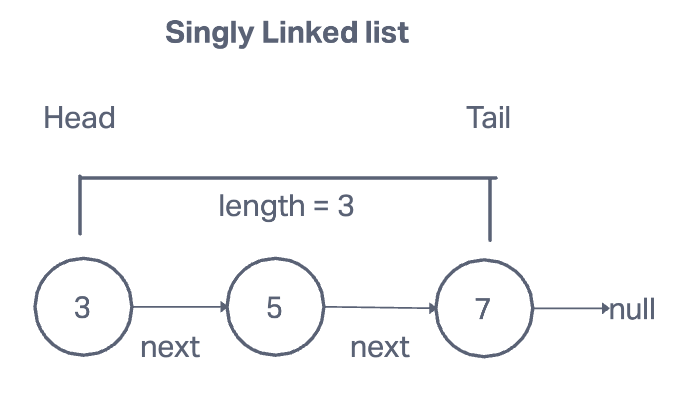

# Linked List

## Singly linked list

    A data structure that contains a head, tail, and length property

    linked list consist of nodes, and each node has a value and a pointer to another node or null

### Compared to Arrays

### List

- do not have indexes
- connected via nodes with a next pointer
- random access is not allowed

### Arrays

- indexed in order
- insertion and deletion con be expensive
- can quickly be accessed at a specific index

## Methods

### Pushing

    Adding a new node to the end of the linked list

    Pseudo Code:

    - This function should accept a value
    - Create a new node using the value passed to the function
    - If there is no head property on the list, set the head and tail to be the newly created node
    - Otherwise set the next property on the tail to be the new node and set the tail property on the list to be the newly created node
    - Increment the length by one
    - Return the linked list

### Popping

    Removing a node from the end of the linked list

    Pseudo Code:

    - If there are no nodes in the list, return undefined
    - Loop through the list until you reach the tail
    - Set the next property of the 2nd to last node to be null
    - Set the tail to be the 2nd to last node
    - Decrement the length of the list by 1
    - Return the value of the node removed

### Shifting

    Remove a new node from the beginnig of the linked list

    Pseudo Code:

    - If there is no nodes, return undefined
    - Store teh current head property in a variable
    - Set the head property te be the current head's next property
    - Decrement the length by 1
    - Return the value of the node removed

### Unshifting

    Adding a new node to the beginning of the linked list

    Pseudo Code:

    - This function should accept a value
    - Create a new node using the value passed to the function
    - If there si sno head property on the list, set the head and tail to be the newly created node
    - Otherwise set the newly created node's next property to be the current head property on the list
    - set head property on the list to be that newly created node
    - Increment the length of the list by 1
    - return the linked list

### Get

    Retrieving a node by it's position in the linked list

    Pseudo Code:

    - This function should accept an index
    - If the index is less than zero or greater than or equal to the length of the list, return null
    - loop through the list until you reach the index and return the node at that specific index

### Set

    Changing the value of a node based on it's position in the linked list

    Pseudo Code:

    - This function should accept a value and an index
    - Use the Get function to find a specific node
    - If the node is not found, return false
    - if the node is found, set the value of that node to be the value passed to the function and return true

### Insert

    Adding a node to the linked list at a specific position

    Pseudo Code:

    - If the index is less than zero or greater than the length, return false
    - If the index is the same as the length, push a new node to the end of the list
    - if the index is 0, unshift a new node to the start of the list
    - Otherwise, using the get method, access the node at the index -1
    - Set the next property on that node to be the new node
    - Set the next property on the new node to be the previous next
    - Increment the length
    - Return true

### Remove

    Removing a node from the linked list at a specific position

    Pseudo Code:

    - If the index is less than zero or greater than the length, return undefined
    - If the index is the same as the length-1, pop
    - If the index is 0, shift
    - Otherwise, using the get method, access the node at the index-1
    - Set the next property on that node to be the next of the next node
    - Decrement the length
    - Return the value of the node removed

### Reverse

    Reversing the linked list in place

    Pseudo Code:

    - Swap the head and tail
    - Create a variable called next
    - Create a variable called prev
    - Create a variable called node and initialize it to the head property
    - Loop through the list
    - Set next to be the next property on whatever node is
    - Set the next property on node to be whatever prev is
    - Set the prev to be the value of the node variable
    - Set the node variable to be the value of the next variable
    - Once you have finished looping, return the list

### search

    Search for a node with a certain value

    Psuedo Code:

    - function takes in a val
    - create a variable called current
    - loop through linked list while current true
      - if current's val is equal to val of argument return true
      - set current to current next
    - if reach the end of the loop and val in not found, return false

## Big O

    Insertion: O(1)
    Removal: O(1) or O(N)
    Searching: O(N)
    Access: O(N)
