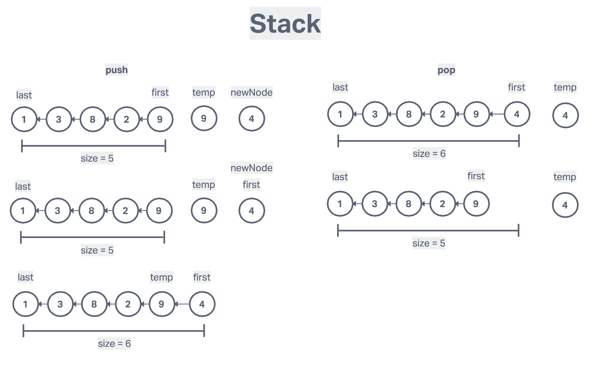
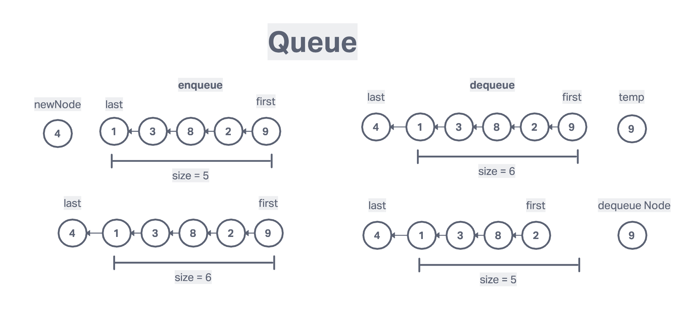

# Stack and Queue

## Stack

### Summary

    LIFO (last in first out)
    The last element added to teh stack will be the first element removed from the stack

### Description

Using a Linked List as the underlying data storage mechanism, implement both a Stack and a Queue

### Use cases

- undo/redo
- routing
- function invocations (stack)

### Stack Big O

    insertion - O(1)
    Removal - O(1)
    Searching - O(N)
    Access - O(N)

### Stack Pseudo code

#### Pushing

- function should accept a value
- create a new node with that value
- if there are no nodes in the stack, set the first and last property to be the newly created node
- if there is at least one node, create a variable that stores the current first property on the stack
- reset the first property to be the newly created node
- set the next property on the node to be the previously created variable
- increment the size of the stack by 1

#### Popping

- if there are no nodes in the stack, return null
- create a temporary variable to store the first property on the stack
- if there is only 1 node, set the first and last property to be null
- if there is more than one node, set the first property to be the next property on the current first
- decrement the size by 1
- return the value of the node removed

[Stack Code Link](stack.js)

---

## Queue

    FIFO (first in first out)
    A data structure that add to a queue and the last element will be the first to be removed from the stack. All elements are first in, first out.

### Use Cases

- people waiting in line
- background task
- uploading resources
- printer

### Queue Big O

    insertion - O(1)
    removal - O(1)
    searching - O(n)
    access - O(n)

### Queue Pseudo Code

#### Enqueue

- this function accepts some value
- create a new node using that value passed to the function
- if there are no nodes in the queue, set this node to be the first and last property of the queue
- Otherwise, set the next property on the current last to be that node, and then set the last property of the queue to be that node

#### Dequeue

- if there is no first property,just return null
- store the first property in a variable
- see if the first is the same as the last (check if there is only 1 node). If so, set the first and last to be null
- decrement the size by 1
- return the value of the node dequeued

[Queue Code link](queue.js)
