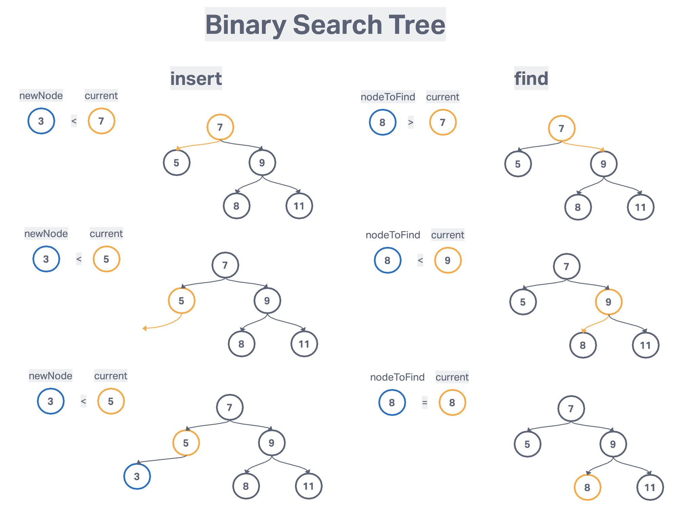

# Binary search tree

- a tree data structure
- every parent node have at most 2 children
- tree is are sorted in a particular way, kept in order
- store data that can be compared, sortable
- every node to the left of a parent node is always less than the parent
- every node to the right of a parent node is always greater than the parent

## Big O

- insert O(log n)
- delete O(log n)
- search O(log n)
- space O(n)

## Pseudo code

### Inserting Node

- create a new node
- starting at the root
  - check if there is a root, if not - the root now becomes the new node
  - if there is a root, check if the value of the new nodes is greater than or less than the value of the root
  - if it is greater
    - check to see if there is a node to the right
      - if there is, move to that node and repeat these steps
      - if there isn't, add that node sa the right property
  - if it is less
    - check to see if there is a node to the left
      - if there is, move to that node and repeat these steps
      - if there isn't, add that node as the left property

### Find Node

- Start at the root
  - check if there is a root, if not - we're done searching
  - if there is a root, check if the value of the new node is the value we are looking for
    - if we found it, we're done
  - if not, check to see if the value is greater than or less than the value of the root
  - if it's greater
    - check to see if there is a node to the right
      - if there is, move to that node and repeat these steps
      - if there isn't, we're done searching
  - if it is less
    - check to see if there is a node to the left
      - if there is, move to that node and repeat these steps
      - if there is not, we're done searching

### Breadth First Search

- create a queue and a variable to store the value of the nodes visited
- place the root node in the queue
- loop as long as there is anything in the queue
  - dequeue a node from the queue and push the value of the node into the variable that stores the nodes
  - if there is left property on the node dequeue, then add it to the queue
  - if there is right property on the node dequeue, then add it to the queue
- return the variable that stores the values

### Depth first search

- create a variable to store the values of the node visited
- store the root of the BST in variable called current
- write a helper function which accepts a node
  - push that value of the node to the variable that stores the values
  - if the node has a left property, call the helper function with the left property on the node
  - if the node has a right property, call the helper function with the right property on the node
- invoke the helper function with the current variable
- return the array of values

